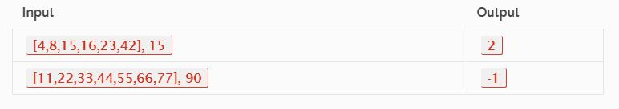

# Binary search in a sorted 1D array

## Problem Domain

This challenge request a function which takes in 2 parameters: a sorted array and the search key. We've to return the index of the array’s element that is equal to the search key, or -1 if the element does not exist with out using the built-in methods.

## Visual



## Code


```
def BinarySearch(arr, n):
    """Doing a binary search to find the position of an integer in a given, sorted, list.
       arr -- sorted list of integers
       n -- -- integer you are searching for its position 
    """
    a = 0
    b = len(arr)-1
    while a <= b:
        i = (a + b)//2
        if arr[i] == n:
            return '{i}'.format(n=n, i=i)
        elif arr[i] < n:
            a = i + 1
        elif arr[i] > n:
            b = i - 1
        else:
            return '{n} not found in the list'.format(n=n)

print(BinarySearch([4,8,15,16,23,42], 43))
```