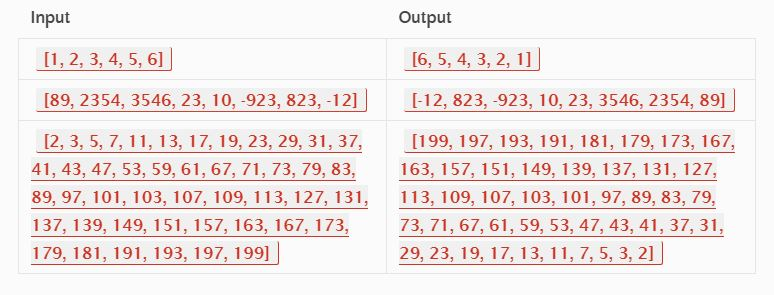

# Reverse of Array

## Problem Domain

This challenge requet a function to revers a list of numbers or array and return the reversed arry with out using the built-in methods.

## Visual



## Algorithm

There are a lot of ways to solve this problem such as the following:

```inputs = reverse_array([1, 2, 3, 4, 5, 6])```

```print(inputs)```

```arr = [89, 2354, 3546, 23, 10, -923, 823, -12]```

```print(arr[::-1])```


```def shift_array(shift, n):```
     ```for i in range(len(shift)):```
         ```if shift[i] > n:```
             ```break```
         ```shift = shift[:i] + [n] + shift[i:]```
         ```return shift```