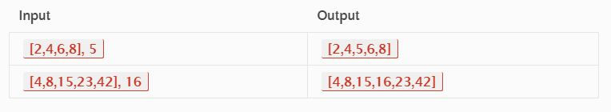

# Shift a value to Array

## Problem Domain

This challenge requet a function which takes in an array and the value to be added and return  the added value in the right position in the array.

## Visual



## Algorithm

There are a lot of ways to solve this problem such as the following:

```def shift_array(shift, n):```

  ```shifted = []```
  
  ```i = 0```  
 ``` for i in range(len(shift)):```
 
    ```if shift[i] < n and shift[i+1] > n:```
      ```shifted.append(shift[i]) ```
      ```shifted.append(n)```
    ```else:```
      ```shifted.append(shift[i])```  
    ```i += 1```
    
  ```return shifted```


