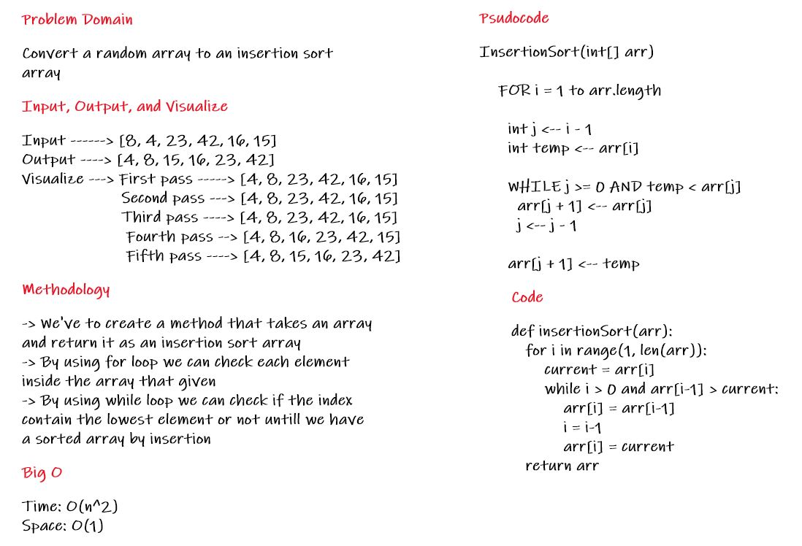

# Insertion Sort 

[Insertion sort](https://en.wikipedia.org/wiki/Insertion_sort) is a simple sorting algorithm that builds the final sorted array (or list) one item at a time. It is much less efficient on large lists than more advanced algorithms such as quicksort, heapsort, or merge sort.

[Insertion sort](https://www.interviewbit.com/tutorial/insertion-sort-algorithm/) is the sorting mechanism where the sorted array is built having one item at a time. The array elements are compared with each other sequentially and then arranged simultaneously in some particular order.

## Pseudocode
```
InsertionSort(int[] arr)
  
    FOR i = 1 to arr.length
    
      int j <-- i - 1
      int temp <-- arr[i]
      
      WHILE j >= 0 AND temp < arr[j]
        arr[j + 1] <-- arr[j]
        j <-- j - 1
        
      arr[j + 1] <-- temp
```

## input & output
Input ---> ```[8, 4, 23, 42, 16, 15]```
Output --> ```[4, 8, 15, 16, 23, 42]```

## Trace
Input ---> ```[8, 4, 23, 42, 16, 15]```

for i = 1 --> Since 4 is smaller than 8, move 8 and insert 4 before 8

First pass ```[4, 8, 23, 42, 16, 15]```

for i = 2 --> 23 will remain at its position as all elements in A[0..I-1] are smaller than 23

Second pass ```[4, 8, 23, 42, 16, 15]```

for i = 3 --> 42 will remain at its position as all elements in A[0..I-1] are smaller than 42

Third pass ```[4, 8, 23, 42, 16, 15]```

for i = 4 --> 16 will move to position after 8, and elements 23, 42 and 15 will move one position ahead of their current position

Fourth pass ```[4, 8, 16, 23, 42, 15]```

for i = 4 --> 15 will move to position after 8, and elements from 16 to 42 will move one position ahead of their current position

Fifth pass ```[4, 8, 15, 16, 23, 42]```

## Efficency

- **Time:** O(n^2)
  - The basic operation of this algorithm is comparison. This will happen n * (n-1) number of times…concluding the algorithm to be n squared.
- **Space:** O(1)
  - No additional space is being created. This array is being sorted in place…keeping the space at constant O(1).

## Whiteborde of Insertion Sort
