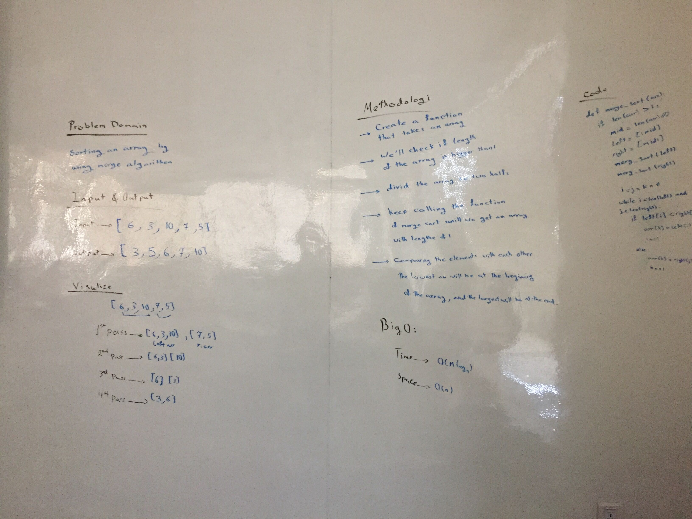

# Merge Sort

[Merge sort](https://www.tutorialspoint.com/data_structures_algorithms/merge_sort_algorithm.htm) is a sorting technique based on divide and conquer technique. With worst-case time complexity being Ο(n log n), it is one of the most respected algorithms.

Merge sort first divides the array into equal halves and then combines them in a sorted manner.

## Pseudocode

```
ALGORITHM Mergesort(arr)
    DECLARE n <-- arr.length
           
    if n > 1
      DECLARE mid <-- n/2
      DECLARE left <-- arr[0...mid]
      DECLARE right <-- arr[mid...n]
      // sort the left side
      Mergesort(left)
      // sort the right side
      Mergesort(right)
      // merge the sorted left and right sides together
      Merge(left, right, arr)

ALGORITHM Merge(left, right, arr)
    DECLARE i <-- 0
    DECLARE j <-- 0
    DECLARE k <-- 0

    while i < left.length && j < right.length
        if left[i] <= right[j]
            arr[k] <-- left[i]
            i <-- i + 1
        else
            arr[k] <-- right[j]
            j <-- j + 1
            
        k <-- k + 1

    if i = left.length
       set remaining entries in arr to remaining values in right
    else
       set remaining entries in arr to remaining values in left
```
## input & output
Input ---> ```[8, 4, 23, 42, 16, 15]```
Output --> ```[4, 8, 15, 16, 23, 42]```
## Trace
Input ---> ```[8, 4, 23, 42, 16, 15]```

Merge sort first divides the whole array iteratively into equal halves unless the atomic values are achieved.

```[8, 4, 23]```  ```[42, 16, 15]```

Now we divide these two arrays into halves.

First array ---> ```[8, 4]``` ```[23]```

second array --> ```[42, 16]``` ```[15]```

We further divide these arrays and we achieve atomic value which can no more be divided. 

First array ---> ```[8]``` ```[4]``` ```[23]```

second array --> ```[42]``` ```[16]``` ```[15]```

Now, we combine them in exactly the same manner as they were broken down.

We first compare the element for each list and then combine them into another list in a sorted manner. We compare 8 and 4 and in the target list of 2 values we put 4 first, followed by 8 in the first array. 

first pass 

First array ---> ```[4]``` ```[8]``` ```[23]```

merge array ---> ```[4, 8]``` ```[23]```

Then We compare 23 and 8 then 23 and 4 then we'll keep 4 first, followed by 8, then followed by 23 in the first array. 

second pass

First array ---> ```[4]``` ```[8]``` ```[23]```

merge array ---> ```[4, 8, 23]```

Then We compare 42 and 16 and in the target list of 2 values we put 16 first, followed by 42 in the second array. 

first pass 

second array --> ```[42]``` ```[16]``` ```[15]```

merge array ---> ```[16, 42]``` ```[15]```

Then We compare 15 and 42 then 15 and 16 then we put 15 first, followed by 16, then followed by 42 in the second array. 

second pass 

second array --> ```[42]``` ```[16]``` ```[15]```

merge array ---> ```[15, 16, 42]```

Now we merge these two arrays together by selecting the smallest value from the front of each list

```[4, 8, 23]``` ```[15, 16, 42]```

first pass ---> ```[4]``` ```[15]``` ---> ```[4]```

second pass --> ```[8]``` ```[15]``` ---> ```[4, 8]```

Third pass ---> ```[23]``` ```[15]``` ---> ```[4, 8, 15]```

Fourth pass --> ```[23]``` ```[16]``` ---> ```[4, 8, 15, 16]```

Fifth pass ---> ```[23]``` ```[24]``` ---> ```[4, 8, 15, 23]```

Sixth pass ---> ```[23]``` ```[24]``` ---> ```[4, 8, 15, 23, 42]```

Merge Sort Array ---> ```[4, 8, 15, 16, 23, 42]```

## Efficency

- **Time:** O(n*log n)
- **Space:** O(n)

## Whiteboard 
